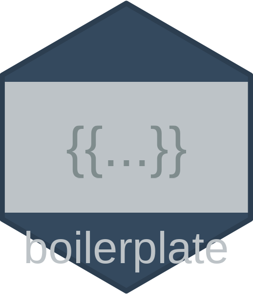

<!-- readme.md is generated from readme.rmd. please edit that file -->



<!-- badges: start -->

[](https://github.com/go-bayes/boilerplate/actions/workflows/R-CMD-check.yaml)
[](https://github.com/go-bayes/boilerplate/actions/workflows/rhub.yaml)
<!-- badges: end -->

## Overview

The `boilerplate` package provides tools for managing and generating
standardised text for methods and results sections of scientific
reports. It handles template variable substitution and supports
hierarchical organisation of text through dot-separated paths.

## Installation

You can install the development version of boilerplate from GitHub with:

``` r
# install the devtools package if you don't have it already
install.packages("devtools")
devtools::install_github("go-bayes/boilerplate")
```

## Features

### Core Features

- **Single Unified Database**: All content types in one JSON file by
  default (simplified workflow)
- **Multiple Categories**: Support for methods, results, discussion,
  measures, appendices and document templates
- **Hierarchical Organisation**: Organise content in nested categories
  using dot notation (e.g., `statistical.longitudinal.lmtp`)
- **Default Content**: Comes with pre-loaded defaults for common methods
  sections
- **Quarto/R Markdown Integration**: Generate sections for scientific
  reports
- **JSON Default Format**: Human-readable JSON as default, with RDS
  support for legacy workflows

### Text and Document Features

- **Text Template Management**: Create, update, and retrieve reusable
  text templates
- **Variable Substitution**: Replace `{{variable}}` placeholders with
  actual values
- **Document Templates**: Streamlined creation of journal articles,
  conference presentations, and grant proposals
- **Custom Headings**: Flexible heading levels and custom text for
  generated sections

### Measurement Features

- **Measures Database**: Special handling for research measures with
  descriptions, items, and metadata
- **Measure Standardisation**: Automatically clean and standardise
  measure entries for consistency
- **Quality Reporting**: Assess completeness and consistency of your
  measures database
- **Formatted Output**: Generate publication-ready measure descriptions
  with multiple format options

### Database Management Features

- **Batch Operations**: Efficiently update or clean multiple entries at
  once with pattern matching and wildcards
- **Preview Mode**: See all changes before applying them to prevent
  accidents
- **Export Functions**: Create backups and share specific database
  subsets
- **Safety Features**: Prevention of accidental file overwrites and
  standardised file naming
- **JSON Migration**: Easy migration from RDS to JSON format with
  validation tools
- **Bibliography Management**: Automatic bibliography file management
  and citation validation

## Safety Features

The boilerplate package includes several safety features to prevent
accidental data loss:

- **Explicit category specification**: The `boilerplate_save()` function
  requires explicit specification of categories when saving individual
  databases
- **Standardised file naming**: Consistent naming conventions
  (`boilerplate_unified.rds` for unified databases, `{category}_db.rds`
  for individual categories)
- **Confirmation prompts**: All functions that modify files include
  confirmation prompts (when `confirm=TRUE`) before overwriting existing
  files
- **Automatic timestamping**: Optional timestamps can be added to
  filenames (when `timestamp=TRUE`) to prevent overwrites
- **Backup creation**: Automatic backup creation before overwriting
  files (when `create_backup=TRUE` in interactive sessions)
- **Directory safety**: Functions require explicit permission to create
  new directories (when `create_dirs=TRUE`)

## Basic Usage with Unified Database

``` r
# install from github if not already installed
if (!require(boilerplate, quietly = TRUE)) {
  # install devtools if necessary
  if (!require(devtools, quietly = TRUE)) {
    install.packages("devtools")
  }
  devtools::install_github("go-bayes/boilerplate")
}

# initialise unified database (default: single JSON file)
boilerplate_init(create_dirs = TRUE, confirm = TRUE)

# import the unified database
unified_db <- boilerplate_import()

# add a new method entry directly to the unified database
unified_db$methods$sample_selection <- "Participants were selected from {{population}} during {{timeframe}}."

# save all changes at once (JSON by default)
boilerplate_save(unified_db)

# generate text with variable substitution
methods_text <- boilerplate_generate_text(
  category = "methods",
  sections = c("sample", "sample_selection"),
  global_vars = list(
    population = "university students",
    timeframe = "2020-2021"
  ),
  db = unified_db,  # pass the unified database
  add_headings = TRUE
)

cat(methods_text)
```

## Bibliography Management

The boilerplate package can manage bibliography files for your projects,
ensuring consistent citations across all your boilerplate text:

``` r
# Add bibliography information to your database
unified_db <- boilerplate_add_bibliography(
  unified_db,
  url = "https://raw.githubusercontent.com/go-bayes/templates/main/bib/references.bib",
  local_path = "references.bib"
)

# Generate text and automatically copy bibliography
methods_text <- boilerplate_generate_text(
  category = "methods",
  sections = "analysis",
  db = unified_db,
  copy_bibliography = TRUE,
  bibliography_path = "manuscript/"
)

# Validate all citations exist in bibliography
validation <- boilerplate_validate_references(unified_db)
if (!validation$valid) {
  warning("Missing references: ", paste(validation$missing, collapse = ", "))
}
```

## Working with JSON Format

The boilerplate package supports JSON format for all database
operations. JSON provides several advantages over the traditional RDS
format:

- **Human-readable**: JSON files can be opened and edited in any text
  editor
- **Version control friendly**: Changes are easily tracked in Git
- **Language agnostic**: JSON files can be read by any programming
  language
- **Web-friendly**: JSON is the standard format for web applications

For detailed JSON workflows, see
`vignette("boilerplate-json-workflow")`.

### Basic JSON Operations

``` r
# import database (automatically detects JSON or RDS format)
unified_db <- boilerplate_import(data_path = "path/to")

# save as JSON
boilerplate_save(unified_db, format = "json")

# migrate existing RDS databases to JSON
results <- boilerplate_migrate_to_json(
  source_path = "boilerplate/data",  # Path to RDS files
  output_path = "json_data",          # Where to save JSON files
  format = "unified",                 # Create single unified file
  backup = TRUE                       # Backup RDS files first
)
```

### JSON with Custom Paths

``` r
# set path for JSON data
my_json_path <- "path/to/json/data"

# import database (auto-detects JSON format)
db <- boilerplate_import(data_path = my_json_path)

# make changes
db$methods$new_method <- "This is a new method using {{technique}}."

# save back as JSON
boilerplate_save(db, data_path = my_json_path, format = "json")
```

### Validating JSON Structure

``` r
# Validate JSON database structure
validation_errors <- validate_json_database(
  "path/to/boilerplate_unified.json",
  type = "unified"
)

if (length(validation_errors) == 0) {
  message("JSON structure is valid!")
} else {
  message("Validation errors found:")
  print(validation_errors)
}
```

## Working with Custom Data Paths

By default, boilerplate stores database files in the “boilerplate/data”
subdirectory of your working directory (using `here::here()`). However,
there are many situations where you might need to use a different
location:

- Working with multiple projects that each need their own boilerplate
  databases
- Storing databases in a shared network location
- Organising files according to a specific project structure
- Testing and development scenarios

All key functions in the package (`boilerplate_init()`,
`boilerplate_import()`, `boilerplate_save()`, and
`boilerplate_export()`) accept a `data_path` parameter to specify a
custom location. When working with custom paths, be sure to use the same
path consistently across all functions.

### Example: Full Workflow with Custom Paths

``` r
# define your custom path
my_project_path <- "path/to/your/project/data"

# Initialise databases in your custom location
boilerplate_init(
  categories = c("measures", "methods", "results", "discussion", "appendix", "template"),
  data_path = my_project_path,  # Specify custom path here
  create_dirs = TRUE,
  confirm = FALSE
)

# import all databases from your custom location
unified_db <- boilerplate_import(
  data_path = my_project_path  # Specify the same custom path
)

# make some changes
unified_db$measures$new_measure <- list(
  name = "new measure scale",
  description = "a newly added measure",
  reference = "author2023",
  waves = "1-2",
  keywords = c("new", "test"),
  items = list("test item 1", "test item 2")
)

# save changes back to your custom location
boilerplate_save(
  db = unified_db,
  data_path = my_project_path,  # Specify the same custom path
  confirm = TRUE
)

# to save just a specific category:
boilerplate_save(
  db = unified_db$measures,
  category = "measures",
  data_path = my_project_path,
  confirm = TRUE
)
```

### Multiple Projects

You can easily work with multiple distinct sets of boilerplate databases
by using different paths:

``` r
# project A
project_a_db <- boilerplate_import(data_path = "projects/project_a/data")

# broject B
project_b_db <- boilerplate_import(data_path = "projects/project_b/data")

# make changes specific to Project A
project_a_db$methods$sample <- "Participants for Project A were recruited from..."
boilerplate_save(project_a_db, data_path = "projects/project_a/data")
```

### Relative vs. Absolute Paths

Both relative and absolute paths are supported:

``` r
# relative path (relative to working directory)
boilerplate_import(data_path = "my_project/data")

# absolute path
boilerplate_import(data_path = "/Users/researcher/projects/study_2023/data")
```

For portable code, consider using relative paths or functions like
`here::here()` to construct paths.

## Lab Workflow: Central Database with Project Copies

A common workflow in research labs involves maintaining a central
boilerplate database on GitHub that team members copy for
project-specific use:

``` r
# 1. Clone the central database from GitHub
# git clone https://github.com/yourlab/boilerplate-database.git

# 2. Copy the database files to your project
# cp -r boilerplate-database/.boilerplate-data my-project/.boilerplate-data

# 3. Import and use in your project (auto-detects format)
db <- boilerplate_import(data_path = ".boilerplate-data")

# 4. Make project-specific changes
db$methods$sample_size <- "We recruited {{n}} participants for {{study_name}}."

# 5. Save locally for your project
# For RDS format:
boilerplate_save(db, data_path = ".boilerplate-data")

# For JSON format:
boilerplate_save(db, data_path = ".boilerplate-data", format = "json")

# 6. If you make changes that should be shared:
# - Copy back to the central repository
# - Submit a pull request with your improvements
```

## Managing Database Versions

The boilerplate package now supports version management for your
databases. When you save databases with timestamps or when backups are
created, you can easily manage and restore these versions.

### Listing Available Versions

Use `boilerplate_list_files()` to see all available database files:

``` r
# List all database files in your data directory
files <- boilerplate_list_files()
print(files)

# List only methods database files
files <- boilerplate_list_files(category = "methods")

# List files from a specific period
files <- boilerplate_list_files(pattern = "202401")  # January 2024 files
```

The function organises files into: - **Standard files**: Current working
versions (e.g., `methods_db.rds`) - **Timestamped versions**: Saved with
timestamps (e.g., `methods_db_20240115_143022.rds`) - **Backup files**:
Automatic backups (e.g., `methods_db_backup_20240115_140000.rds`)

### Importing Specific Versions

The enhanced `boilerplate_import()` function can now import any database
file directly:

``` r
# Import the current standard version (default behaviour)
db <- boilerplate_import("methods")

# Import a specific timestamped version
db <- boilerplate_import(data_path = "boilerplate/data/methods_db_20240115_143022.rds")

# Import a backup file
db <- boilerplate_import(data_path = "boilerplate/data/methods_db_backup_20240115_140000.rds")
```

### Restoring from Backups

Use `boilerplate_restore_backup()` for convenient backup restoration:

``` r
# View the latest backup without restoring
backup_db <- boilerplate_restore_backup("methods")

# Restore the latest backup as the current version
db <- boilerplate_restore_backup(
  category = "methods",
  restore = TRUE,
  confirm = TRUE  # Will ask for confirmation
)

# Restore a specific backup by timestamp
db <- boilerplate_restore_backup(
  category = "methods",
  backup_version = "20240110_120000",
  restore = TRUE
)
```

### Version Management Workflow

Here’s a typical workflow for managing versions:

``` r
# 1. Check what versions are available
files <- boilerplate_list_files("methods")

# 2. Save current work with timestamp
boilerplate_save(
  db = methods_db,
  category = "methods",
  timestamp = TRUE  # Creates methods_db_20240115_150000.rds
)

# 3. If you need to revert changes, restore from backup
boilerplate_restore_backup("methods", restore = TRUE)

# 4. Compare versions before deciding
current_db <- boilerplate_import("methods")
old_db <- boilerplate_import(
  data_path = "boilerplate/data/methods_db_20240110_120000.rds"
)

# 5. Import and merge specific versions if needed
v1 <- boilerplate_import(data_path = files$timestamped$path[1])
v2 <- boilerplate_import(data_path = files$timestamped$path[2])
```

### Best Practices

1.  **Regular timestamped saves**: Save important milestones with
    timestamps
2.  **Keep recent backups**: The package automatically creates backups,
    but consider archiving important versions
3.  **Document version changes**: Use meaningful commit messages when
    saving versions
4.  **Clean up old files**: Periodically review and remove unnecessary
    old versions

### Embedding in Analysis Documents

Rather than creating separate `.qmd` files, you can embed boilerplate
directly in your analysis code chunks:

``` r
# at the beginning of your analysis script or Quarto document
library(boilerplate)

# define global variables
study_params <- list(
  n_participants = 250,
  study_name = "Study 1",
  recruitment_method = "online panels",
  analysis_software = "R version 4.3.0"
)

# import database
db <- boilerplate_import(data_path = ".boilerplate-data")

# benerate methods text when needed
methods_sample <- boilerplate_generate_text(
  category = "methods",
  sections = "sample",
  global_vars = study_params,
  db = db
)

# use the text directly in your document
cat("## Methods\n\n", methods_sample)
```

## Working with Individual Databases

You can still work with individual databases if preferred:

``` r
# import just the methods database
methods_db <- boilerplate_import("methods")

# add a new method entry
methods_db$sample_selection <- "Participants were selected from {{population}} during {{timeframe}}."

# save just the methods database
boilerplate_save(methods_db, "methods")

# generate text with variable substitution
methods_text <- boilerplate_generate_text(
  category = "methods",
  sections = c("sample", "sample_selection"),
  global_vars = list(
    population = "university students",
    timeframe = "2020-2021"
  ),
  db = methods_db,
  add_headings = TRUE
)

cat(methods_text)
```

## Creating Empty Databases

The package supports initialising empty database structures by default,
providing a clean slate for your project without sample content.

``` r
# initialise empty databases (default behavior)
boilerplate_init(
  categories = c("methods", "results"),
  data_path = "~/project/data",
  create_dirs = TRUE
)

# initialise with default content when needed
boilerplate_init(
  categories = c("methods", "results"),
  data_path = "~/project/data",
  create_dirs = TRUE,
  create_empty = FALSE
)
```

Empty databases provide just the top-level structure without example
content, making it easier to start with a clean slate.

## Database Export

The package now supports exporting databases for versioning or sharing
specific elements:

``` r
# export entire database for versioning
# creates a point-in-time snapshot of your boilerplate content
unified_db <- boilerplate_import()
boilerplate_export(
  db = unified_db,
  output_file = "boilerplate_v1.0.rds",
  data_path = "~/project/data"
)

# export selected elements (specific methods and results)
# useful for sharing specialized subsets with collaborators
boilerplate_export(
  db = unified_db,
  output_file = "causal_methods_subset.rds",
  select_elements = c("methods.statistical.*", "results.main_effect"),
  data_path = "~/project/data"
)
```

The export function supports: - Full database export (ideal for
versioning) - Selective export using dot notation (e.g.,
“methods.statistical.longitudinal”) - Wildcard selections using “*”
(e.g., ”methods.*” selects all methods) - Category-prefixed paths for
unified databases

Export is distinct from save: use `boilerplate_save()` for normal
database updates and `boilerplate_export()` for creating standalone
exports.

## Managing Measures with the Unified Database

The package provides a simplified way to manage measures and generate
formatted text about them. Measures are stored as top-level entries in
the measures database, with each measure containing standardised
properties like name, description, reference, etc.

``` r
# import the unified database
unified_db <- boilerplate_import()

# Add a measure directly to the unified database
# Note: Measures should be at the top level of the measures database
unified_db$measures$anxiety_gad7 <- list(
  name = "generalised anxiety disorder scale (GAD-7)",
  description = "anxiety was measured using the GAD-7 scale.",
  reference = "spitzer2006",
  waves = "1-3",
  keywords = c("anxiety", "mental health", "gad"),
  items = list(
    "feeling nervous, anxious, or on edge",
    "not being able to stop or control worrying",
    "worrying too much about different things",
    "trouble relaxing"
  )
)

# save the entire unified database
boilerplate_save(unified_db)

# alternatively, save just the measures portion
boilerplate_save(unified_db$measures, "measures")

# then generate text referencing the measure by its top-level name
exposure_text <- boilerplate_generate_measures(
  variable_heading = "Exposure Variable",
  variables = "anxiety_gad7", # match the name you used above
  db = unified_db,  # can pass the unified database
  heading_level = 3,
  subheading_level = 4,
  print_waves = TRUE
)
cat(exposure_text)

# you can also use the helper function to extract just the measures
measures_db <- boilerplate_measures(unified_db)

# generate text for outcome variables using just the measures database
psych_text <- boilerplate_generate_measures(
  variable_heading = "Psychological Outcomes",
  variables = c("anxiety_gad7", "depression_phq9"),
  db = measures_db,  # or use the extracted measures database
  heading_level = 3,
  subheading_level = 4,
  print_waves = TRUE
)
cat(psych_text)

# generate statistical methods text
stats_text <- boilerplate_generate_text(
  category = "methods",
  sections = c("statistical.longitudinal.lmtp"),
  global_vars = list(software = "R version 4.2.0"),
  add_headings = TRUE,
  custom_headings = list("statistical.longitudinal.lmtp" = "LMTP"),
  heading_level = "###",
  db = unified_db  # pass the unified database
)

# initialise a sample text (assuming this was defined earlier)
sample_text <- boilerplate_generate_text(
  category = "methods",
  sections = "sample",
  global_vars = list(population = "university students", timeframe = "2023-2024"),
  db = unified_db
)

# combine all sections into a complete methods section
methods_section <- paste(
  "## Methods\n\n",
  sample_text, "\n\n",
  "### Variables\n\n",
  exposure_text, "\n",
  "### Outcome Variables\n\n",
  psych_text, "\n\n",
  stats_text,
  sep = ""
)
cat(methods_section)

# save the methods section to a file that can be included in a quarto document
# writeLines(methods_section, "methods_section.qmd")
```

### Important Notes on Measure Structure

When adding measures to the database:

- Each measure should be a top-level entry in the measures database
- Standard properties include: name, description, reference, waves,
  keywords, and items
- The items property should be a list of item text strings
- When referencing measures in `boilerplate_generate_measures()`, use
  the top-level name

**Incorrect structure (avoid this):**

``` r
# don't organise measures under categories at the top level
unified_db$measures$psychological$anxiety <- list(...)  # WRONG
```

**Correct structure:**

``` r
# Add measures directly at the top level
unified_db$measures$anxiety_gad7 <- list(...)  # CORRECT
unified_db$measures$depression_phq9 <- list(...) # CORRECT
```

## Standardising and Reporting on Measures

The package includes powerful tools for standardising measure entries
and reporting on database quality. This is particularly useful when
working with legacy databases or when multiple contributors have added
measures with inconsistent formatting.

### Standardising Measures

The `boilerplate_standardise_measures()` function automatically cleans
and standardises your measures:

``` r
# Import your database
unified_db <- boilerplate_import()

# Check quality before standardisation
boilerplate_measures_report(unified_db$measures)

# Standardise all measures
unified_db$measures <- boilerplate_standardise_measures(
  unified_db$measures,
  extract_scale = TRUE,      # Extract scale info from descriptions
  identify_reversed = TRUE,   # Identify reversed items
  clean_descriptions = TRUE,  # Clean up description text
  verbose = TRUE             # Show what's being done
)

# Save the standardised database
boilerplate_save(unified_db)
```

### What Standardisation Does

1.  **Extracts Scale Information**: Identifies and extracts scale
    details from descriptions

    ``` r
    # Before:
    description = "Ordinal response: (1 = Strongly Disagree, 7 = Strongly Agree)"

    # After:
    description = NULL  # Removed if only contains scale info
    scale_info = "1 = Strongly Disagree, 7 = Strongly Agree"
    scale_anchors = c("1 = Strongly Disagree", "7 = Strongly Agree")
    ```

2.  **Identifies Reversed Items**: Detects items marked with (r),
    (reversed), etc.

    ``` r
    # Items with (r) markers are identified
    items = list(
      "I have frequent mood swings.",
      "I am relaxed most of the time. (r)",
      "I get upset easily."
    )
    # Creates: reversed_items = c(2)
    ```

3.  **Cleans Descriptions**: Removes extra whitespace, fixes punctuation

4.  **Standardises References**: Ensures consistent reference formatting

5.  **Ensures Complete Structure**: All measures have standard fields

### Quality Reporting

Use `boilerplate_measures_report()` to assess your measures database:

``` r
# get a quality overview
boilerplate_measures_report(unified_db$measures)

# Output:
# === Measures Database Quality Report ===
# Total measures: 180
# Complete descriptions: 165 (91.7%)
# With references: 172 (95.6%)
# With items: 180 (100.0%)
# With wave info: 178 (98.9%)
# Already standardised: 180 (100.0%)

# get detailed report as data frame
quality_report <- boilerplate_measures_report(
  unified_db$measures, 
  return_report = TRUE
)

# find measures missing information
missing_refs <- quality_report[!quality_report$has_reference, ]
missing_desc <- quality_report[!quality_report$has_description, ]

# View specific measure details
View(quality_report)
```

### Standardising Specific Measures

You can also standardise individual measures or a subset:

``` r
# standardise only specific measures
unified_db$measures <- boilerplate_standardise_measures(
  unified_db$measures,
  measure_names = c("anxiety_gad7", "depression_phq9", "self_esteem")
)

# or standardise a single measure
unified_db$measures$anxiety_gad7 <- boilerplate_standardise_measures(
  unified_db$measures$anxiety_gad7
)
```

### Enhanced Output with Standardised Measures

After standardisation, the `boilerplate_generate_measures()` function
can better format your measures:

``` r
# Generate formatted output with enhanced features
measures_text <- boilerplate_generate_measures(
  variable_heading = "Psychological Measures",
  variables = c("self_control", "neuroticism"),
  db = unified_db,
  table_format = TRUE,        # Use table format
  sample_items = 3,           # Show only 3 items per measure
  check_completeness = TRUE,  # Note any missing information
  quiet = TRUE               # Suppress progress messages
)

cat(measures_text)
```

Example output:

    ### Psychological Measures

    #### Self Control

    | Field | Information |
    |-------|-------------|
    | Description | Self-control was measured using two items [@tangney_high_2004]. |
    | Response Scale | 1 = Strongly Disagree, 7 = Strongly Agree |
    | Waves | 5-current |

    **Items:**

    1. In general, I have a lot of self-control
    2. I wish I had more self-discipline (r)

    *(r) denotes reverse-scored item*

    #### Neuroticism

    | Field | Information |
    |-------|-------------|
    | Description | Mini-IPIP6 Neuroticism dimension [@sibley2011]. |
    | Response Scale | 1 = Strongly Disagree, 7 = Strongly Agree |
    | Waves | 1-current |

    **Items:**

    1. I have frequent mood swings.
    2. I am relaxed most of the time. (r)
    3. I get upset easily.

    *(1 additional items not shown)*

    *(r) denotes reverse-scored item*

### Best Practices

1.  Run standardisation after importing legacy databases to ensure
    consistency
2.  Check the quality report to identify measures needing attention
3.  Review standardised output before saving to ensure nothing important
    was lost
4.  Keep the original - use `boilerplate_export()` to create a backup
    before standardising
5.  Document changes - the standardisation adds metadata showing when
    measures were standardised

## Batch Editing and Cleaning Databases

The package includes powerful functions for batch editing and cleaning
your databases. These are particularly useful when you need to update
multiple entries at once or clean up inconsistent formatting.

### Batch Editing Fields

Use `boilerplate_batch_edit()` to update specific fields across multiple
entries:

``` r
# Load your database
unified_db <- boilerplate_import()

# Example 1: Update specific references
unified_db <- boilerplate_batch_edit(
  db = unified_db,
  field = "reference",
  new_value = "sibley2021",
  target_entries = c("ban_hate_speech", "born_nz", "age"),
  category = "measures"
)

# Example 2: Update all references containing "NZAVS"
unified_db <- boilerplate_batch_edit(
  db = unified_db,
  field = "reference",
  new_value = "sibley2021",
  match_pattern = "NZAVS",
  category = "measures"
)

# Example 3: Use wildcards to target groups of entries
unified_db <- boilerplate_batch_edit(
  db = unified_db,
  field = "waves",
  new_value = "1-15",
  target_entries = "anxiety*",  # All entries starting with "anxiety"
  category = "measures"
)

# Example 4: Update entries with specific values
unified_db <- boilerplate_batch_edit(
  db = unified_db,
  field = "reference",
  new_value = "sibley2024",
  match_values = c("dore2022boundaries", "string_is Developed for the NZAVS."),
  category = "measures"
)
```

### Preview Before Editing

Always preview changes before applying them:

``` r
# preview what would change
boilerplate_batch_edit(
  db = unified_db,
  field = "reference",
  new_value = "sibley2021",
  target_entries = c("ban_hate_speech", "born_nz"),
  category = "measures",
  preview = TRUE
)

# output shows what would change:
# Preview of changes:
# ℹ ban_hate_speech: "dore2022boundaries" -> "sibley2021"
# ℹ born_nz: "sibley2011" -> "sibley2021"
# ✓ Would update 2 entries
```

### Batch Editing Multiple Fields

Edit multiple fields in one operation:

``` r
# update both reference and waves for specific entries
unified_db <- boilerplate_batch_edit_multi(
  db = unified_db,
  edits = list(
    list(
      field = "reference",
      new_value = "sibley2021",
      target_entries = c("ban_hate_speech", "born_nz")
    ),
    list(
      field = "waves",
      new_value = "1-15",
      target_entries = c("ban_hate_speech", "born_nz")
    )
  ),
  category = "measures"
)
```

### Batch Cleaning Fields

Clean up formatting issues across your database:

``` r
# Example 1: Remove unwanted characters from references
unified_db <- boilerplate_batch_clean(
  db = unified_db,
  field = "reference",
  remove_chars = c("@", "[", "]"),
  category = "measures"
)

# Example 2: Clean all entries EXCEPT specific ones
unified_db <- boilerplate_batch_clean(
  db = unified_db,
  field = "reference",
  remove_chars = c("@", "[", "]"),
  exclude_entries = c("forgiveness", "special_measure"),
  category = "measures"
)

# Example 3: Clean with pattern matching and exclusions
unified_db <- boilerplate_batch_clean(
  db = unified_db,
  field = "reference",
  remove_chars = c("@", "[", "]"),
  target_entries = "emp_*",        # All entries starting with "emp_"
  exclude_entries = "emp_special",  # Except this one
  category = "measures"
)

# Example 4: Multiple cleaning operations
unified_db <- boilerplate_batch_clean(
  db = unified_db,
  field = "description",
  remove_chars = c("(", ")"),
  replace_pairs = list("  " = " "),  # Replace double spaces with single
  trim_whitespace = TRUE,
  collapse_spaces = TRUE,
  category = "measures"
)
```

### Finding Entries That Need Cleaning

Before cleaning, identify which entries contain specific characters:

``` r
# Find all entries with problematic characters
entries_to_clean <- boilerplate_find_chars(
  db = unified_db,
  field = "reference",
  chars = c("@", "[", "]"),
  category = "measures"
)

# View the results
print(entries_to_clean)

# Find entries but exclude some from results
entries_to_clean <- boilerplate_find_chars(
  db = unified_db,
  field = "reference",
  chars = c("@", "[", "]"),
  exclude_entries = c("forgiveness", "special_*"),
  category = "measures"
)
```

### Workflow Example: Cleaning References

Here’s a complete workflow for cleaning up reference formatting:

``` r
# 1. First, see what needs cleaning
problem_refs <- boilerplate_find_chars(
  db = unified_db,
  field = "reference",
  chars = c("@", "[", "]", " "),
  category = "measures"
)

cat("Found", length(problem_refs), "references that need cleaning\n")

# 2. Preview the cleaning operation
boilerplate_batch_clean(
  db = unified_db,
  field = "reference",
  remove_chars = c("@", "[", "]"),
  replace_pairs = list(" " = "_"),  # Replace spaces with underscores
  trim_whitespace = TRUE,
  category = "measures",
  preview = TRUE
)

# 3. Apply the cleaning
unified_db <- boilerplate_batch_clean(
  db = unified_db,
  field = "reference",
  remove_chars = c("@", "[", "]"),
  replace_pairs = list(" " = "_"),
  trim_whitespace = TRUE,
  category = "measures",
  confirm = TRUE  # Will ask for confirmation
)

# 4. Save the cleaned database
boilerplate_save(unified_db)
```

### Best Practices for Batch Operations

1.  **Always preview first**: Use `preview = TRUE` to see what will
    change

2.  **Make backups**: Export your database before major changes

    ``` r
    boilerplate_export(unified_db, output_file = "backup_before_cleaning.rds")
    ```

3.  **Use exclusions carefully**: Some entries might have special
    formatting requirements

4.  **Test on subsets**: Try operations on a few entries before applying
    to all

5.  **Document changes**: Keep notes about what was changed and why

### Common Use Cases

**Standardising References**

``` r
# Convert various reference formats to consistent style
unified_db <- boilerplate_batch_clean(
  db = unified_db,
  field = "reference",
  remove_chars = c("@", "[", "]", "(", ")"),
  replace_pairs = list(
    " " = "",           # Remove spaces
    "," = "_",          # Replace commas
    "&" = "and"         # Replace ampersands
  ),
  category = "measures"
)
```

**Updating Wave Information**

``` r
# Update all measures from a specific wave range
unified_db <- boilerplate_batch_edit(
  db = unified_db,
  field = "waves",
  new_value = "1-16",
  match_values = c("1-15", "1-current"),
  category = "measures"
)
```

**Fixing Description Formatting**

``` r
# Clean up description formatting issues
unified_db <- boilerplate_batch_clean(
  db = unified_db,
  field = "description",
  replace_pairs = list(
    ".." = ".",         # Fix double periods
    " ." = ".",         # Fix space before period
    "  " = " "          # Fix double spaces
  ),
  trim_whitespace = TRUE,
  category = "measures"
)
```

These batch operations make it easy to maintain consistency across your
entire database, especially when dealing with legacy data or
contributions from multiple sources.

## Appendix Content with the Unified Database

The package supports appendix content that can be managed within the
unified database:

``` r
# import the unified database
unified_db <- boilerplate_import()

# add detailed measures documentation to appendix
unified_db$appendix$detailed_measures <- "# Detailed Measures Documentation\n\n## Overview\n\nThis appendix provides comprehensive documentation for all measures used in this study, including full item text, response options, and psychometric properties.\n\n## {{exposure_var}} Measure\n\n{{exposure_details}}\n\n## Outcome Measures\n\n{{outcome_details}}"

# save the changes to the unified database
boilerplate_save(unified_db)

# generate appendix text with variable substitution
appendix_text <- boilerplate_generate_text(
  category = "appendix",
  sections = c("detailed_measures"),
  global_vars = list(
    exposure_var = "Perfectionism",
    exposure_details = "The perfectionism measure consists of 3 items...",
    outcome_details = "Anxiety was measured using the GAD-7 scale..."
  ),
  db = unified_db  # pass the unified database
)

cat(appendix_text)
```

## Creating Complete Document Workflows

You can create complete workflows that integrate methods, results, and
templates using the unified database:

``` r
# import the unified database
unified_db <- boilerplate_import()

# function to generate a complete document from a template
generate_document <- function(template_name, study_params, section_contents, db) {
  # extract the template using the boilerplate_template helper
  template_text <- boilerplate_template(db, template_name)
  
  # apply template variables (combining study params and section contents)
  all_vars <- c(study_params, section_contents)
  
  # replace placeholders in template
  for (var_name in names(all_vars)) {
    placeholder <- paste0("{{", var_name, "}}")
    template_text <- gsub(placeholder, all_vars[[var_name]], template_text, fixed = TRUE)
  }
  
  return(template_text)
}

# define study parameters
study_params <- list(
  title = "Political Orientation and Social Wellbeing in New Zealand",
  authors = "Jane Smith, John Doe, and Robert Johnson",
  date = format(Sys.Date(), "%B %d, %Y")
)

# define section contents
section_contents <- list(
  abstract = "This study investigates the causal effects of political orientation on social wellbeing using data from the New Zealand Attitudes and Values Study.",
  introduction = "Understanding the causal effects of political orientation on wellbeing has important implications for social policy and public health...",
  methods_sample = "Participants were recruited from university students during 2020-2021.",
  methods_measures = "Political orientation was measured using a 7-point scale...",
  methods_statistical = "We used the LMTP estimator to address confounding...",
  results = "Our analysis revealed reliable causal effects of political conservatism on social wellbeing...",
  discussion = "These findings suggest that political orientation may causally influence wellbeing along the following dimensions..."
)

# generate the document
journal_article <- generate_document(
  template_name = "journal_article",
  study_params = study_params,
  section_contents = section_contents,
  db = unified_db
)

cat(substr(journal_article, 1, 2500), "...")
```

## Advanced Usage: Audience-Specific Reports with the Unified Database

You can create tailored reports for different audiences from the same
underlying data:

``` r
# import the unified database
unified_db <- boilerplate_import()

# add audience-specific LMTP descriptions
unified_db$methods$statistical_estimator$lmtp$technical_audience <- "We estimate causal effects using the Longitudinal Modified Treatment Policy (LMTP) estimator within a Targeted Minimum Loss-based Estimation (TMLE) framework. This semi-parametric estimator leverages the efficient influence function (EIF) to achieve double robustness and asymptotic efficiency."

unified_db$methods$statistical_estimator$lmtp$applied_audience <- "We estimate causal effects using the LMTP estimator. This approach combines machine learning with causal inference methods to estimate treatment effects while avoiding strict parametric assumptions."

unified_db$methods$statistical_estimator$lmtp$general_audience <- "We used advanced statistical methods that account for multiple factors that might influence both {{exposure_var}} and {{outcome_var}}. This method helps us distinguish between mere association and actual causal effects."

# save the updated unified database
boilerplate_save(unified_db)

# function to generate methods text for different audiences
generate_methods_by_audience <- function(audience = c("technical", "applied", "general"), db) {
  audience <- match.arg(audience)
  
  # select appropriate paths based on audience
  lmtp_path <- paste0("statistical_estimator.lmtp.", audience, "_audience")
  
  # generate text
  boilerplate_generate_text(
    category = "methods",
    sections = c("sample", lmtp_path),
    global_vars = list(
      exposure_var = "political_conservative",
      outcome_var = "social_wellbeing"
    ),
    db = db
  )
}

# generate reports for different audiences
technical_report <- generate_methods_by_audience("technical", unified_db)
applied_report <- generate_methods_by_audience("applied", unified_db)
general_report <- generate_methods_by_audience("general", unified_db)

cat("General audience report:\n\n", general_report)
```

## Helper Functions for the Unified Database

The unified database approach includes several helper functions to
extract specific categories:

``` r
# import the unified database
unified_db <- boilerplate_import()

# extract specific categories using helper functions
methods_db <- boilerplate_methods(unified_db)
measures_db <- boilerplate_measures(unified_db)
results_db <- boilerplate_results(unified_db)
discussion_db <- boilerplate_discussion(unified_db)
appendix_db <- boilerplate_appendix(unified_db)
template_db <- boilerplate_template(unified_db)

# extract specific items using dot notation
lmtp_method <- boilerplate_methods(unified_db, "statistical.longitudinal.lmtp")
anxiety_measure <- boilerplate_measures(unified_db, "anxiety_gad7")
main_result <- boilerplate_results(unified_db, "main_effect")

# you can also directly access via the list structure
causal_assumptions <- unified_db$methods$causal_assumptions$identification
```

## Document Templates with the Unified Database

The package supports document templates that can be used to create
complete documents with placeholders for dynamic content:

``` r
# import unified database
unified_db <- boilerplate_import()

# add a custom conference abstract template
unified_db$template$conference_abstract <- "# {{title}}\n\n**Authors**: {{authors}}\n\n## Background\n{{background}}\n\n## Methods\n{{methods}}\n\n## Results\n{{results}}"

# save the updated unified database
boilerplate_save(unified_db)

# generate a document from template with variables
abstract_text <- boilerplate_generate_text(
  category = "template",
  sections = "conference_abstract",
  global_vars = list(
    title = "Effect of Political Orientation on Well-being",
    authors = "Smith, J., Jones, A.",
    background = "Previous research has shown mixed findings...",
    methods = "We used data from a longitudinal study (N=47,000)...",
    results = "We found significant positive effects..."
  ),
  db = unified_db
)

cat(abstract_text)
```

## Complete Workflow Example with the Unified Database

This example demonstrates combining multiple components to create a
complete methods section using the unified database approach:

``` r
# initialise all databases and import them
boilerplate_init(create_dirs = TRUE, confirm = TRUE)
unified_db <- boilerplate_import()

# add perfectionism measure to the unified database
unified_db$measures$perfectionism <- list(
  name = "perfectionism",
  description = "Perfectionism was measured using a 3-item scale assessing maladaptive perfectionism tendencies.",
  reference = "rice_short_2014",
  waves = "10-current",
  keywords = c("personality", "mental health"),
  items = list(
    "Doing my best never seems to be enough.",
    "My performance rarely measures up to my standards.",
    "I am hardly ever satisfied with my performance."
  )
)

# save the updated unified database
boilerplate_save(unified_db)

# define parameters
study_params <- list(
  exposure_var = "perfectionism",
  population = "New Zealand Residents Enroled in Electoral Roll in 2021",
  timeframe = "2021-2025",
  sampling_method = "convenience"
)

# generate methods text for participant selection
sample_text <- boilerplate_generate_text(
  category = "methods",
  sections = c("sample_selection"),
  global_vars = study_params,
  add_headings = TRUE,
  heading_level = "###",
  db = unified_db
)
cat(sample_text)

# generate measures text for exposure variable
exposure_text <- boilerplate_generate_measures(
  variable_heading = "Exposure Variable",
  variables = "perfectionism",
  heading_level = 3,
  subheading_level = 4,
  print_waves = TRUE, 
  db = unified_db
)

cat(exposure_text)
```

## Citation

To cite the boilerplate package in publications, please use:

Bulbulia, J. (2025). boilerplate: Tools for Managing and Generating
Standardised Text for Scientific Reports. R package version 1.1.0
<https://doi.org/10.5281/zenodo.13370825>

A BibTeX entry for LaTeX users:

    @software{bulbulia_boilerplate_2025,
      author       = {Bulbulia, Joseph},
      title        = {{boilerplate: Tools for Managing and Generating 
                       Standardised Text for Scientific Reports}},
      year         = 2025,
      publisher    = {Zenodo},
      version      = {1.0.45},
      doi          = {10.5281/zenodo.13370825},
      url          = {https://github.com/go-bayes/boilerplate}
    }

## Licence

MIT © Joseph Bulbulia

## See Also

For specific workflows: - JSON support: See
`vignette("boilerplate-json-workflow")` - Quarto integration: See
`vignette("boilerplate-quarto-workflow")` - Getting started: See
`vignette("boilerplate-intro")`

### Example Files

The package includes example files in the `inst/` directory: - **Quarto
example**:
`system.file("examples", "minimal-quarto-example.qmd", package = "boilerplate")` -
**JSON workflows**: See files in
`system.file("examples/json-examples", package = "boilerplate")` -
**Example data**: CSV and JSON examples in
`system.file("extdata", package = "boilerplate")`
